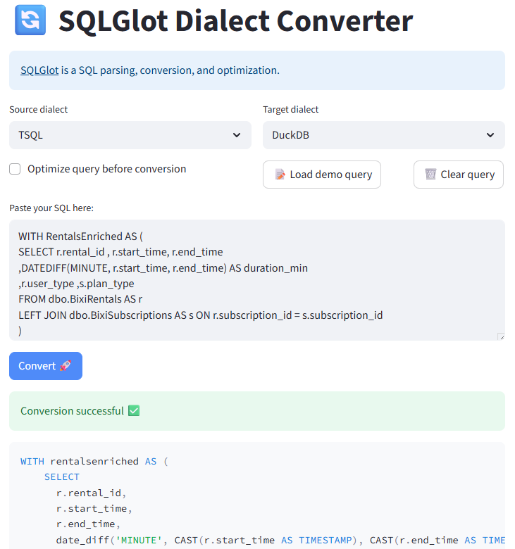

# SQLGlot Dialect Converter

This tool allows you to **convert SQL queries from one dialect to another** and, if desired, **automatically optimize** their structure.  
It is particularly useful for data teams that need to migrate or standardize SQL scripts across different engines (e.g., TSQL → DuckDB) while maintaining code readability and consistency.

👉 [sqlglot-converter.streamlit.app](https://sqlglot-converter.streamlit.app/)

## 🚀 Technologies Used

- [Streamlit](https://streamlit.io/) — Interactive web interface  
- [SQLGlot](https://github.com/tobymao/sqlglot) — SQL parsing, conversion, and optimization  
- [uv](https://github.com/astral-sh/uv) — Fast dependency management and execution

## 📦 Installation & Launch

```bash
uv run streamlit run app.py
```

## ✨ Features

- Selection of source and target dialects
- Automatic conversion via SQLGlot
- SQLGlot optimization option (normalization, rewriting)
- Load a demo query from demo_tsql.sql
- Simple and responsive interface

## 📷 Rendering

👉 [sqlglot-converter.streamlit.app](https://sqlglot-converter.streamlit.app/)



## Linked projects

- [Streamlit SQLGlot AST viewer](https://sqlglot-ast-viewer.streamlit.app/) by [Thomas Johnson](https://www.linkedin.com/in/thomcjohnson/)
